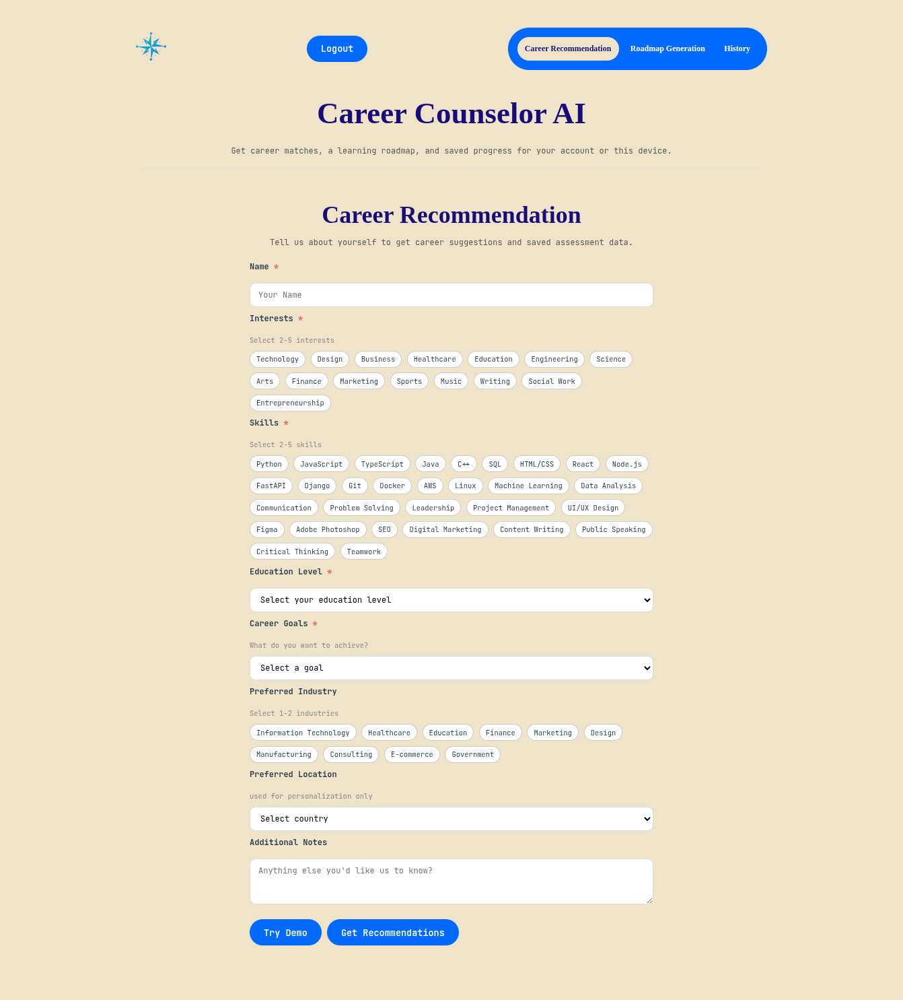
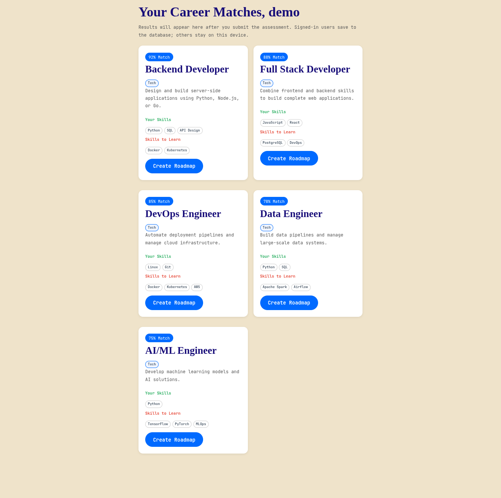
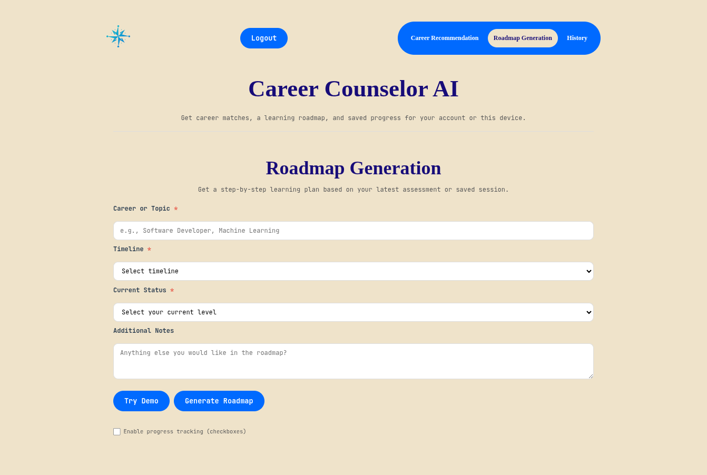
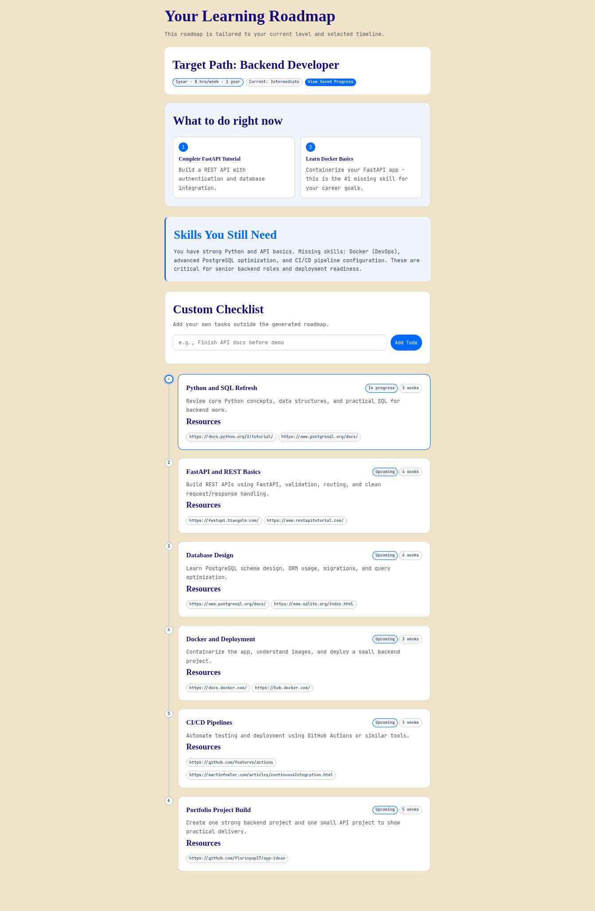

# career-counselor-ai

A web-based AI career counseling system that recommends career paths based on user interests and background, with personalized learning roadmaps and skill-gap analysis.

## Features

- **Career Recommendation** — AI-powered career matching with fit scores, reasoning, and skill-gap analysis
- **Roadmap Generation** — Personalized step-by-step learning paths with timeline and progress tracking
- **Skill Gap Analysis** — Identifies missing skills for a target role with actionable next steps
- **History** — Track past assessments and completed roadmap steps (device-local or account-synced)
- **User Accounts** — Register/login for cross-device history sync; demo mode available without login
- **Multi-Provider AI Gateway** — Supports OpenAI, Anthropic, OpenRouter, OpenCode Zen, and NVIDIA NIM with parallel fallback
- **Vanilla JS Frontend** — No build tools, no npm — runs directly in any browser

## Project structure

```
career-counselor-ai/
├── frontend/
│   ├── index.html              # Single-page app (3 tabs: Career, Roadmap, History)
│   ├── css/
│   │   └── style.css           # Full stylesheet
│   └── js/
│       └── main.js             # All frontend logic (API calls, forms, modals)
│
├── backend/
│   ├── main.py                 # FastAPI app entry point
│   ├── models.py               # SQLAlchemy ORM models (6 tables)
│   ├── database.py             # Database engine/session setup
│   ├── repositories.py         # Static form options data
│   ├── requirements.txt        # Python dependencies
│   ├── seed_demo.py            # Demo user seed script
│   ├── .env.example            # Environment variable template
│   ├── routes/
│   │   ├── auth.py             # Login/register endpoints
│   │   ├── db_options.py       # Form options endpoints
│   │   ├── history.py          # Assessment history CRUD
│   │   ├── recommendations.py  # Assess, roadmap, skill-gap endpoints
│   │   └── tasks.py            # Task progress endpoints
│   └── services/
│       └── ai_gateway.py       # Multi-provider AI gateway
│
├── docs/
│   ├── REQUIREMENTS.md         # SRS document
│   ├── IMPLEMENTATION_READY.md # Implementation readiness checklist
│   ├── AGENT_EXECUTION_PLAN.md # Parallel execution plan
│   ├── CLASSMATE_TASKS.md      # Non-tech teammate task templates
│   ├── se-deliverables.md      # SE deliverables guide
│   ├── deliverables-guide.md   # Deliverables reference
│   ├── 01_Project_Proposal.md  # Full SE deliverable suite (01-08)
│   └── adr/                    # Architecture Decision Records
│
├── .github/
│   └── skills/                 # Git workflow, task delegation, documentation standards
│
├── run.sh                      # Start frontend + backend together
├── tasks.csv                   # Sprint tracking (Sprints 1-5)
├── AGENTS.md                   # Agent instructions
├── LICENSE                     # MIT License
└── README.md
```

## Problem Statement

Students face three big questions when planning their future:

1. Which career path fits their interests, background, and goals
2. What degree programs, courses, and subjects should they take
3. How do they get from beginner to job-ready with a step-by-step roadmap

This project follows iterative development using the Scrum framework.

## Tech stack

- **Frontend:** HTML5, CSS3, Vanilla JavaScript (no build tools)
- **Backend:** Python FastAPI
- **Database:** MySQL/MariaDB via SQLAlchemy + PyMySQL
- **AI Gateway:** Multi-provider support — OpenAI, Anthropic, OpenRouter, OpenCode Zen, NVIDIA NIM (parallel execution with fallback)
- **Auth:** Session-based with SHA-256 password hashing (user accounts for history sync)

## Data Model

Six tables store career, skill, roadmap, assessment, and progress data:

| Table | Purpose |
|-------|---------|
| `users` | User accounts (username, password, created_at) |
| `student_assessments` | Assessment submissions (interests, skills, goals, location) |
| `career_fits` | AI-generated career matches with fit scores and reasoning |
| `assessment_history` | Full assessment records for history view |
| `user_progress` | Roadmap step completion tracking |
| `task_progress` | Individual task progress per session |

The seed flow uses local project data, not an external occupational API.

## API Endpoints

| Method | Endpoint | Description |
|--------|----------|-------------|
| `GET` | `/` | Health check |
| `GET` | `/ping` | Ping |
| `GET` | `/db/health` | Database health check |
| `POST` | `/api/assess` | Career assessment — returns AI-generated career fits |
| `POST` | `/api/roadmap` | Roadmap generation — returns learning path with phases |
| `POST` | `/api/skill-gap-analysis` | Skill gap analysis — compares current vs target skills |
| `GET` | `/api/ai/status` | AI provider configuration status |
| `POST` | `/api/ai/test` | Test AI gateway |
| `POST` | `/api/tasks` | Update task progress |
| `GET` | `/api/tasks/{session_id}` | Get session progress summary |
| `POST` | `/api/auth/register` | Register new user |
| `POST` | `/api/auth/login` | Login user |
| `GET` | `/api/auth/me` | Get current user info |
| `GET` | `/api/history` | Get user assessment history |
| `DELETE` | `/api/history/{assessment_id}` | Delete assessment record |
| `GET` | `/options/skills` | Predefined skills list |
| `GET` | `/options/interests` | Predefined interests list |
| `GET` | `/options/industries` | Predefined industries list |
| `GET` | `/options/locations` | Predefined locations list |

## Quick Start

```bash
# Start both frontend and backend
./run.sh

# Or start them separately:
# Backend:  cd backend && uvicorn main:app --reload --port 8001
# Frontend: cd frontend && python3 -m http.server 8000
```

Frontend: http://localhost:8000
Backend API: http://localhost:8001

### Database Setup

Create a MariaDB/MySQL database named `career_counselor` and configure `backend/.env` from `backend/.env.example`.

## Demo

### Career Recommendation





### Roadmap Generation





## License

This project is licensed under the MIT License — see the [LICENSE](LICENSE) file for details.
